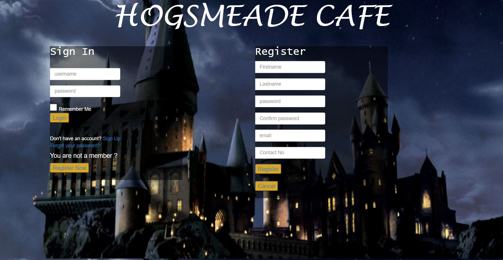
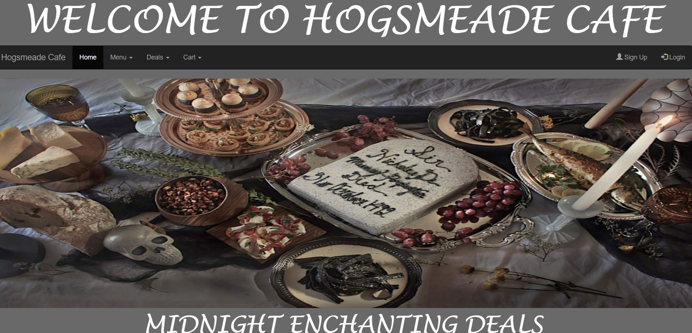
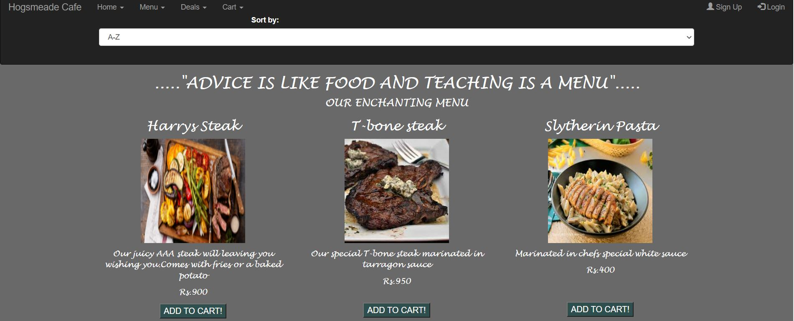
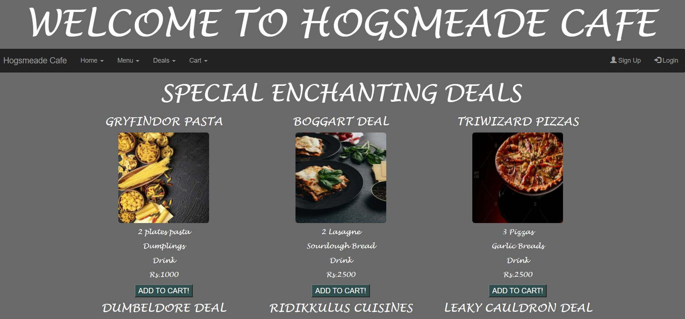
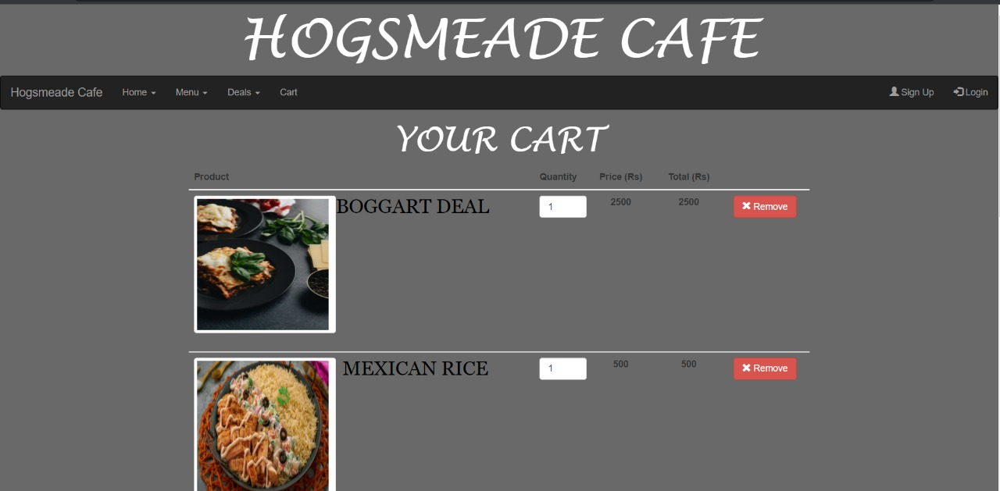
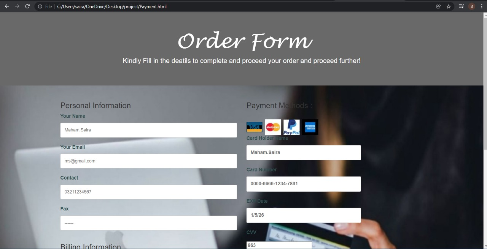

# Hogsmeade Cafe - Food Website

Welcome to **Hogsmade Cafe**! This website is a Harry Potter-themed food website designed for a cafe, featuring pages such as login, home, menu, deals, cart, and a payment form. This project was built using HTML, CSS, and Bootstrap to create a visually appealing, responsive experience for users.

## Features

The website includes the following pages:

### 1. **Login Page**
   - Allows users to log in or sign up for an account.
   - **Design**: Hogwarts Castle background with Bootstrap cards to organize the login form.
   - Once logged in, users are redirected to the Home Page.

   

### 2. **Home Page**
   - An introductory page to the Hogsmade Cafe website.
   - Features a grey background to match the Harry Potter theme.
   - Includes a navigation bar to access other pages and displays three deals from the menu.
   - Showcases the cafe’s logo and footer information.

   

### 3. **Menu Page**
   - Displays a list of items available in the cafe, categorized by type.
   - Each item has a description and an "Add to Cart" button.
   - A "Go to Cart" button allows users to view their cart.

   

### 4. **Deals Page**
   - Lists various food deals with prices and descriptions.
   - Each deal has an "Add to Cart" button for easy purchase.
   - A "Go to Cart" button redirects users to the cart page.

   

### 5. **Cart Page**
   - Displays selected items with their prices and allows users to update quantities.
   - Includes a "Proceed to Payment" button to navigate to the payment page.

   

### 6. **Payment Page**
   - A form that collects customer details for order processing, including name, contact number, email, shipping address, and payment method.
   - A "Place and Order" button redirects to the homepage after submission.

   

## Technologies Used

- **HTML**: Structure of the website.
- **CSS**: Styling for the website layout.
- **Bootstrap**: For responsive design and UI components.

